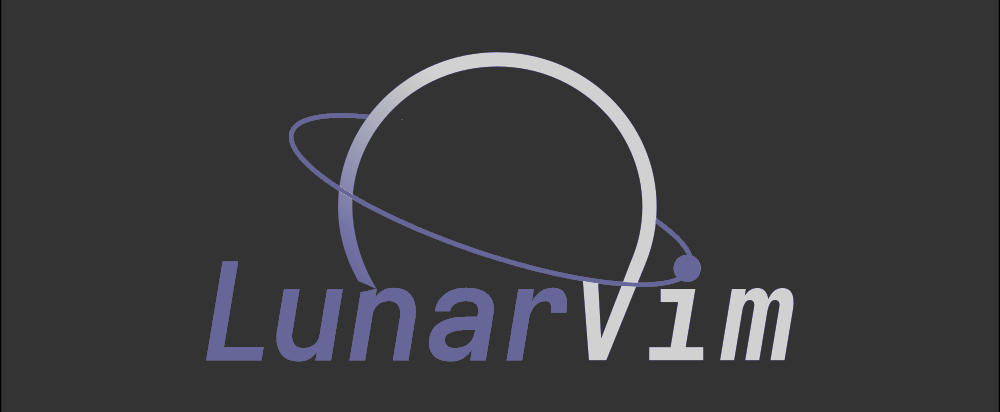

A Featureful and Opinionated NeoVim config based on LunarVim, but with more of a focus on features and suiting environment than being a flexible IDE usabled and customizable by many. Thank you Christian for making such a wonderful base for me to build on, and I may keep 'taking inspiration' from the changes you make ;).

Once LunarVim is 'released' I may redo all of this to be a user config of LunarVim.
